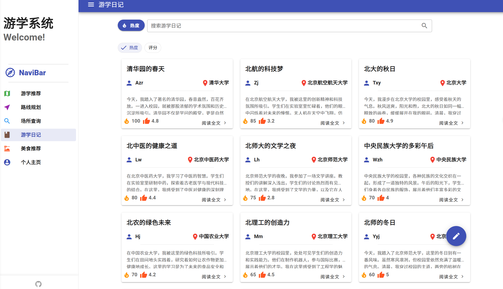

# BuptTravel 北邮数据结构课程设计——游学系统
## 前后端框架： Vue+SpringBoot (本仓库为前端代码)
## 项目的网站已部署：[github pages](https://12345txy.github.io/Data_Structure_Project/)
### 点击链接[TravelRecommend](https://12345txy.github.io/Data_Structure_Project/#/TravelRecommend)可以进入项目首页，展开侧边栏可以跳转
### 日记管理页面纯前端：

